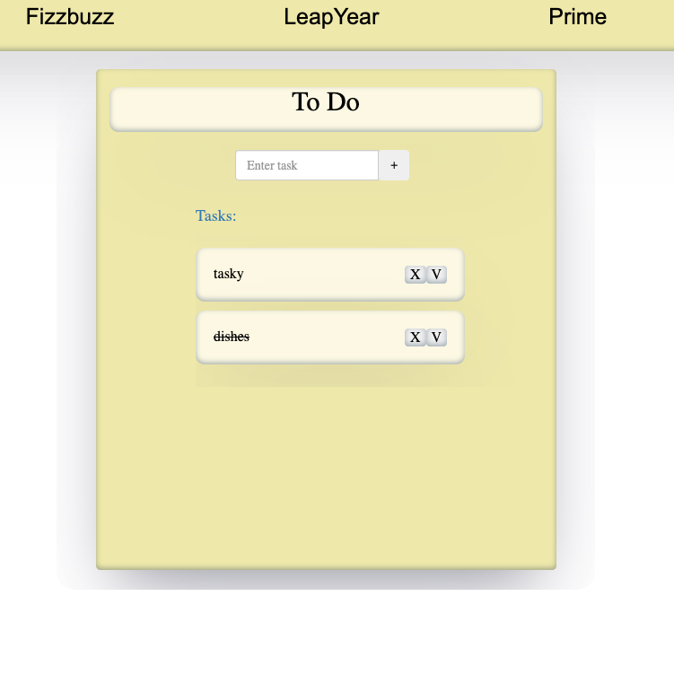

# Project Setup Guide

Follow the steps below to set up and run the projects.

### Redis Server Setup

1. **Install Redis (if not installed):**
    ```sh
    brew install redis
    ```

2. **Start Redis Server:**
    ```sh
    redis-server
    ```

## Angular Project Setup

### Initial Setup

1. Navigate into the `angularProject`.
    ```sh
    cd path-to-your-project/angularProject
    ```
2. Install the dependencies:
    ```sh
    npm install
    ```

### Starting the Backend Server

1. Start the server using Node.js.
    ```sh
    node server.js
    ```

2. Navigate into the `server` directory.
    ```sh
    cd server
    ```

### Running Angular App

In a new terminal, navigate to the `angularProject` and start the Angular app:

```sh
cd path-to-your-project/angularProject
ng serve
```

please check if these ports are correct for your uses

/server /redis 
```
const redis = new Redis({
  host: 'localhost', // Redis host
  port: 6379,        // Redis port
});
```

/model/crudservices
```
export class CrudService {
  private serviceURL = "http://localhost:3000"; // Update the URL to your backend server
```


## iOS Project Setup and Configuration

### Configuration

Check if the port is the same for you from the Node server: 3000 from the backend server

```swift
struct API {
    static let baseURL = "http://localhost:3000/tasks"
}
```





